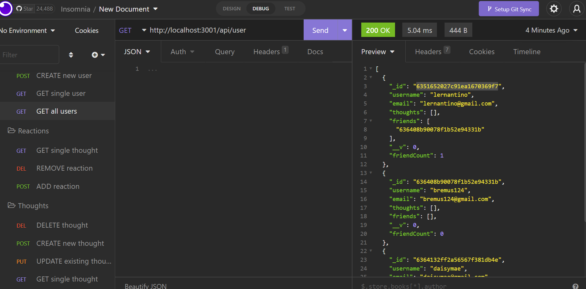
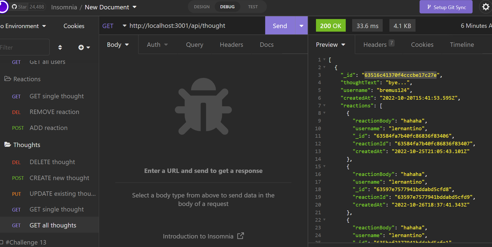

# -Social-network-web-application

    - Built an API for a social network web application where users can share their thoughts, react to friends’ thoughts, and create a friend list. Used: Express.js for routing, a MongoDB database, and the Mongoose ODM.

--

## Author

- ## [@brittanyremus](https://www.github.com/bremus124)

## Screenshot

--

## Deployment

- To deploy this project run:
  - Video :https://drive.google.com/file/d/1jNfyKtbkhlUMKCGKbPm05M4mz4lfdt1l/view
  - Repository: https://github.com/bremus124/-social-network-web-application
